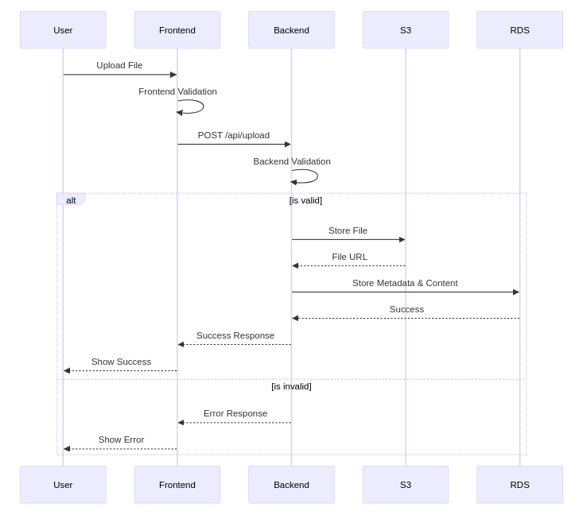

# System Architecture

## Table of Contents
- [Overview](#overview)
- [System Components](#system-components)
- [Data Flow](#data-flow)
- [Technology Stack](#technology-stack)
- [Security Architecture](#security-architecture)
- [Scalability Considerations](#scalability-considerations)

## Overview
FileVault is a distributed system designed to handle secure file uploads, storage, and management. The architecture follows a market standars with clear separation between frontend, backend, and storage services.

## System Components

### Frontend (React Application)
- **Role**: User interface and client-side validation
- **Key Features**:
  - File upload interface
  - Client-side file validation
  - Real-time feedback
  - Search and filter capabilities
- **Technology**: React with TypeScript, TailwindCSS

### Backend (Django REST API)
- **Role**: Business logic and data management
- **Key Features**:
  - File validation and processing
  - AWS service integration
  - Authentication and authorization
  - API endpoint management
- **Technology**: Django 5.0, Django REST Framework

### Storage Services
- **S3 Bucket**: Primary storage for uploaded files
- **RDS MySQL**: Metadata and content storage
- **Role**: Persistent data storage and management

## Data Flow

### File Upload Process

### Key Flow Points
1. **Initial Upload**: User selects and uploads file through frontend interface
2. **Frontend Validation**: 
   - File size check (0.5KB to 2KB)
   - File type validation (.txt only)
3. **Backend Processing**:
   - Secondary validation
   - File content processing
   - AWS S3 upload
   - Metadata storage in RDS
4. **Response Handling**:
   - Success/error feedback to user
   - Error handling at each step

## Technology Stack

### Frontend Layer
- React 18+
- TypeScript
- TailwindCSS
- Jest for testing
- Axios for API communication

### Backend Layer
- Django 5.0
- Django REST Framework
- Boto3 for AWS integration
- PyTest for testing

### Infrastructure Layer
- AWS S3 for file storage
- AWS RDS (MySQL) for database
- Docker for containerization
- Terraform for infrastructure management

## Security Architecture

### Data Security
- File encryption at rest (AWS S3)
- Secure file transfer (HTTPS)
- Input validation at multiple levels
- SQL injection prevention

### AWS Security
- IAM roles and policies
- VPC configuration
- Security groups
- Encryption in transit and at rest