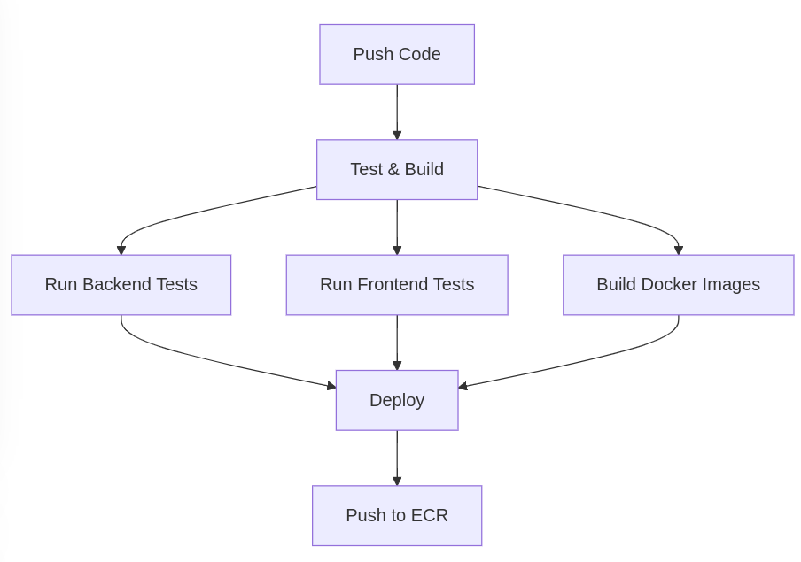

# CI/CD Pipeline

## Table of Contents
- [Overview](#overview)
- [Pipeline Stages](#pipeline-stages)
- [Required Secrets](#required-secrets)
- [Deployment Process](#deployment-process)

## Overview

The CI/CD pipeline uses GitHub Actions to automate testing, building, and deploying the application to AWS ECR. The pipeline is triggered on:
- Push to `main` branch
- Pull requests to `main` branch

## Pipeline Stages



## Required Secrets

### Application Secrets
```yaml
# Django Settings
DEBUG: "0"
SECRET_KEY: "your-django-secret-key"
FRONTEND_URL: "https://your-frontend-url"

# AWS Configuration
AWS_REGION: "us-east-1"
AWS_STORAGE_BUCKET_NAME: "your-s3-bucket"
AWS_ACCESS_KEY_ID: "your-aws-access-key"
AWS_SECRET_ACCESS_KEY: "your-aws-secret-key"

# Database Configuration
DATABASE_NAME: "your-db-name"
DATABASE_USER: "your-db-user"
DATABASE_PASSWORD: "your-db-password"
DATABASE_HOST: "your-rds-endpoint"
DATABASE_PORT: "3306"

# ECR Configuration
ECR_REPOSITORY_BACKEND: "your-backend-repo"
ECR_REPOSITORY_FRONTEND: "your-frontend-repo"
```

### Setting Up Secrets

1. Navigate to your GitHub repository
2. Go to Settings → Secrets and Variables → Actions
3. Click "New repository secret"
4. Add each secret listed above

## Deployment Process

### 1. Test and Build Stage
```yaml
test-and-build:
  runs-on: ubuntu-latest
  steps:
    - Run backend tests (Python 3.11)
    - Run frontend tests (Node.js 20)
    - Build Docker images
```

### 2. Deploy Stage
```yaml
deploy:
  needs: test-and-build
  runs-on: ubuntu-latest
  steps:
    - Configure AWS credentials
    - Login to Amazon ECR
    - Build and push images with tags:
      - latest
      - git SHA
```