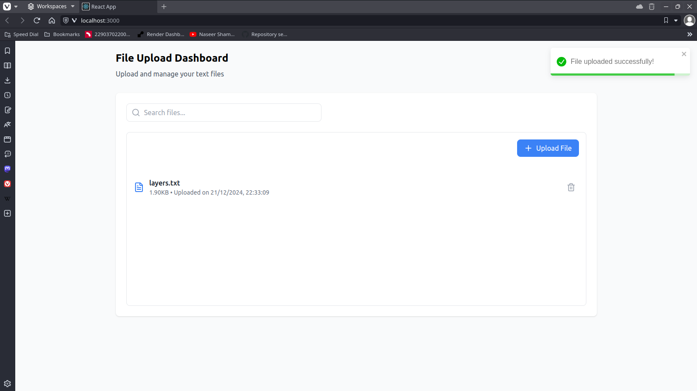

# Frontend Features

## Table of Contents
- [Type-Safe API Integration](#type-safe-api-integration)
- [Error Handling System](#error-handling-system)
- [Data Validation](#data-validation)




## Type-Safe API Integration

The frontend implements a robust, type-safe API integration using TypeScript and Axios:

```typescript
interface ApiFile {
  id: number;
  name: string;
  size: number;
  uploaded_at: string;
}

interface UploadedFile {
  id: number;
  name: string;
  size: string;
  uploadDate: string;
}

interface ApiResponse<T> {
  data: T;
  status: string;
}
```

Key Features:
- Strong typing for API responses
- Data transformation layer
- Type-safe error handling
- Response interceptors

## Error Handling System

### Centralized Error Handling
```typescript
private handleAxiosError(error: AxiosError<ErrorResponse>): never {
  if (error.response) {
    const apiError: ApiError = {
      message: error.response.data?.error || 'Server error',
      code: error.response.status.toString(),
      details: error.response.data,
    };
    throw apiError;
  }
  
  if (error.request) {
    throw new Error('No response received from server');
  }
  
  throw new Error('Error setting up request');
}
```

Error Categories:
- Response errors (server errors)
- Request errors (network issues)
- Setup errors (configuration issues)
- Validation errors (client-side)

## Data Validation

### Response Validation
```typescript
private transformFileData(file: ApiFile): UploadedFile {
  validateFileData(file);
  return {
    id: file.id,
    name: file.name,
    size: file.size.toFixed(2),
    uploadDate: new Date(file.uploaded_at).toLocaleString(),
  };
}
```

Validation Features:
- Runtime type checking
- Data transformation
- Null/undefined handling
- Format standardization

### File Upload Flow
```typescript
async uploadFile(file: File): Promise<UploadedFile> {
  try {
    if (!file || !(file instanceof File)) {
      throw new ValidationError('Invalid file object');
    }

    const formData = new FormData();
    formData.append('file', file);

    const response = await this.api.post<ApiResponse<ApiFile>>(
      '/files/', 
      formData,
      {
        headers: {
          'Content-Type': 'multipart/form-data',
        },
      }
    );

    const validatedData = validateApiResponse(response.data);
    return this.transformFileData(validatedData);
  } catch (error) {
    // Error handling...
  }
}
```

The file upload process includes:
- File object validation
- FormData creation
- Content-Type specification
- Response validation
- Data transformation